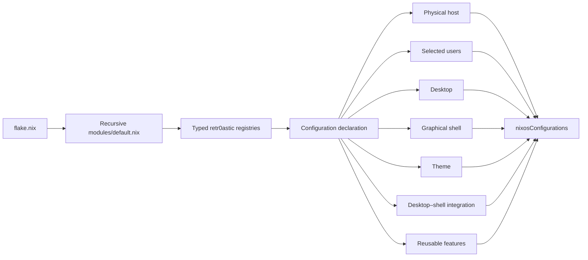

<div align="center">

# ❄️ Retr0astic NixOS

**A personal, dendritic NixOS configuration for composing hosts, desktops, shells, themes, users, and features.**

[](https://nixos.org/)
[](https://nixos.wiki/wiki/Flakes)
[](https://github.com/hercules-ci/flake-parts)
[](https://github.com/nix-community/home-manager)

`NixOS Unstable` · `flake-parts` · `Home Manager` · `Hyprland` · `Noctalia`

*Sree’s personal machine configuration — useful as a reference, not a turnkey distribution.*

</div>

---

## ✨ Overview

This repository declares a complete NixOS system as a small set of named,
composable choices. A recursive flake-parts module graph discovers registrations
for the physical Chapel host, a rebuildable configuration, Hyprland, Noctalia,
the Noctalia theme, the Sree user, and reusable system/Home Manager features.

The physical host and the user-facing configuration are separate layers. That
keeps Chapel-specific boot, storage, NVIDIA, monitor, and hardware policy in
`hosts/chapel/` or explicitly named Chapel features, while desktop and graphical
shell behavior remain independently registered. Home Manager is composed for
each selected user by the configuration generator.

## 🌿 Highlights

| Capability | What it means here |
| --- | --- |
| Dendritic self-registration | Public `.nix` files under `modules/` register themselves; no central import list grows over time. |
| Typed deferred modules | Registries use lazy string-keyed options and deferred NixOS/Home Manager module values. |
| Rebuild-time composition | A configuration selects its host, desktop, shell, theme, users, and features by name. |
| Explicit compatibility | `retr0astic.integrations` is the authoritative desktop–shell pairing registry. |
| Per-user Home Manager isolation | Each user receives their own personal home module plus shared selected modules. |
| Feature-local ownership | A selected feature contributes both `feature.system` and `feature.home` automatically. |
| Generated outputs | Configuration declarations become same-named `nixosConfigurations`; aliases reuse canonical objects. |
| Chapel graphics policy | NVIDIA, monitor, HDR, and OpenRGB behavior is kept in Chapel-specific registrations. |
| Reproducible Noctalia assets | Repository-owned assets are installed from an immutable `builtins.path` source. |
| NVF package | The flake exposes a configured `packages.x86_64-linux.nvf` output. |

## 🧭 Architecture



## 🌱 Dendritic design

The repository is dendritic in the practical sense that its public module
registrations are top-level flake-parts modules. `flake.nix` declares inputs,
the supported system, and one import: `modules/default.nix`. That importer
recursively discovers `.nix` registrations under `modules/`.

The schema defines open string-keyed registries for hosts, configurations,
aliases, desktops, shells, themes, users, features, and integrations. Names
are resolved and validated only when configurations are generated. Lower-level
implementations travel as typed, lazy `deferredModule` values, so unselected
choices remain lazy and new names do not require schema enums or a central
configuration generator edit.

There are deliberate exceptions: underscore-prefixed private helpers such as
`modules/packages/_nvf/package.nix` are excluded, generated Chapel hardware
stays under `hosts/chapel/`, and non-Nix Noctalia assets are ordinary data.

<details>
<summary>How selection becomes a system</summary>

`modules/configurations.nix` resolves the named host, desktop, shell, theme,
users, and features. It adds each feature’s deferred `system` and `home` side,
then composes the selected desktop, shell, theme, and integration. Home Manager
receives a per-user import list: that user’s personal module followed by the
shared selected modules. Finally, the configuration record becomes a
`nixosConfigurations` entry and aliases are resolved to existing entries.

</details>

## 🧩 Composition model

| Concept | Meaning |
| --- | --- |
| Host | A physical machine and its host-owned system policy. |
| Configuration | A rebuildable composition of named selections. |
| Desktop | The compositor or desktop session; currently Hyprland. |
| Shell | The graphical UI stack; currently Noctalia. |
| Theme | Reusable styling and theme assets; currently Noctalia. |
| User | A system account and its personal Home Manager module. |
| Feature | A reusable capability with `system` and `home` sides. |
| Integration | An explicitly supported desktop–shell pair. |
| Alias | An alternate name resolving to a canonical configuration. |

The current composition is:

```text
chapel + hyprland + noctalia + noctalia theme + sree
```

`chapel` is the public alias for `chapel-hyprland-noctalia`; both resolve to
the same canonical configuration object.

## 📦 Available outputs

Confirmed flake outputs include:

```text
nixosConfigurations.chapel
nixosConfigurations.chapel-hyprland-noctalia
packages.x86_64-linux.nvf
devShells.x86_64-linux.default
```

The flake also exposes these checks for `x86_64-linux`:

```text
checks.x86_64-linux.composition-contract
checks.x86_64-linux.registry-contract
checks.x86_64-linux.registry-failure-contract
```

## 🖼️ Desktop

> Screenshots will be added after the configuration lands on the main branch.

## 🗂️ Repository layout

```text
.
├── flake.nix                         # flake-parts entrypoint and inputs
├── modules/
│   ├── default.nix                   # recursive registration importer
│   ├── schema.nix                    # typed retr0astic registries
│   ├── configurations.nix            # composition and output generation
│   ├── checks.nix                    # contract checks
│   ├── hosts/                        # host and configuration registrations
│   ├── desktops/                     # desktop registrations
│   ├── shells/                       # graphical-shell registrations
│   ├── themes/                       # theme registrations
│   ├── integrations/                 # supported desktop–shell pairs
│   ├── features/                     # reusable system/home capabilities
│   ├── users/                        # user registrations
│   ├── packages/                     # package outputs and private helpers
│   └── noctalia/                     # repository-owned Noctalia assets
├── hosts/
│   └── chapel/                       # Chapel hardware, boot, and storage
└── docs/                             # architecture migration record
```

## 🔧 Rebuild

This configuration is written for Chapel. Audit the host and hardware modules
before adapting it to another machine; it is not expected to rebuild unchanged
on arbitrary hardware.

Test a configuration first:

```bash
sudo nixos-rebuild test --flake .#chapel

sudo nixos-rebuild test \
  --flake .#chapel-hyprland-noctalia
```

After confirming the test activation behaves as expected, a persistent switch
can be used deliberately:

```bash
sudo nixos-rebuild switch --flake .#chapel
```

## ✅ Validate

```bash
nix flake show
nix flake check

nix build \
  .#nixosConfigurations.chapel.config.system.build.toplevel \
  --no-link
```

Use `nix flake show` to inspect the current output surface and
`nix flake check` to run the repository’s composition and registry contracts.

## 🛠️ Extend the configuration

Additions are registrations, not edits to a central list. The small examples
below show the shape of the public API; adapt module bodies to the relevant
NixOS or Home Manager options.

### Add a host or configuration variant

Register a host with a hostname, system, and host module, then declare a
configuration that selects it:

```nix
config.retr0astic.hosts.lantern = {
  hostname = "lantern";
  system = "x86_64-linux";
  module = ./lantern/host.module.nix;
};

config.retr0astic.configurations.lantern-hyprland-noctalia = {
  host = "lantern";
  desktop = "hyprland";
  shell = "noctalia";
  theme = "noctalia";
  users = ["sree"];
  features = ["core"];
};
```

Every declaration generates a same-named `nixosConfigurations` output. Add an
alias only when a second public name is useful:

```nix
config.retr0astic.configurationAliases.lantern =
  "lantern-hyprland-noctalia";
```

### Add a desktop, shell, theme, user, feature, or integration

Each public module belongs under its owning directory and self-registers:

```nix
config.retr0astic.desktops.niri = {
  system = {programs.niri.enable = true;};
  home = {wayland.windowManager.niri.enable = true;};
};

config.retr0astic.integrations.niri-noctalia = {
  desktop = "niri";
  shell = "noctalia";
  system = {};
  home = {};
};
```

Graphical-shell pairings are explicit: a new desktop or shell is not available
in a configuration until its integration record exists. A feature exposes
`system` and `home` values and is selected by name; its name is not added to
the configuration generator. A user exposes separate system and personal home
values, and personal home modules are applied only to that user. Themes and
shells remain separate from pair-specific behavior.

Adding any of these registrations does not require editing `flake.nix`, the
schema’s list of names, the recursive importer, or a hardcoded feature-home
list.

<details>
<summary>Validation behavior</summary>

Unknown names fail with the available values. Unsupported desktop–shell pairs
fail with the selected pair, supported pairs, and the required corrective
action: add an explicit record to `retr0astic.integrations`.

</details>

## 🖥️ Current Chapel stack

| Layer | Current choice |
| --- | --- |
| System | NixOS unstable on `x86_64-linux` |
| Desktop | Hyprland with UWSM and XWayland |
| Graphical shell | Noctalia |
| Theme | Noctalia configuration and assets |
| Home management | Home Manager |
| Graphics | NVIDIA, with Chapel-specific monitor/HDR policy |
| Login | SDDM with SilentSDDM integration |
| Shell | Fish with Starship |
| Editor package | NVF |

## ⚠️ Caveats

- This is Sree’s personal configuration, not a general-purpose distribution.
- Boot, LUKS, filesystems, storage, generated hardware, NVIDIA, monitors, HDR,
  and OpenRGB settings are Chapel-specific.
- No secrets are expected to be committed; inspect every module before reuse.
- Noctalia assets are repository-owned and installed reproducibly from the
  flake source tree.
- Runtime behavior can change with the repository’s current unstable inputs.

## 🙏 Acknowledgements

This configuration builds on [NixOS](https://github.com/NixOS/nixpkgs),
[flake-parts](https://github.com/hercules-ci/flake-parts),
[Home Manager](https://github.com/nix-community/home-manager),
[Hyprland](https://github.com/hyprwm/Hyprland),
[Noctalia](https://github.com/noctalia-dev/noctalia),
[NVF](https://github.com/NotAShelf/nvf), and
[SilentSDDM](https://github.com/uiriansan/SilentSDDM).

## License

No license has been added yet.
